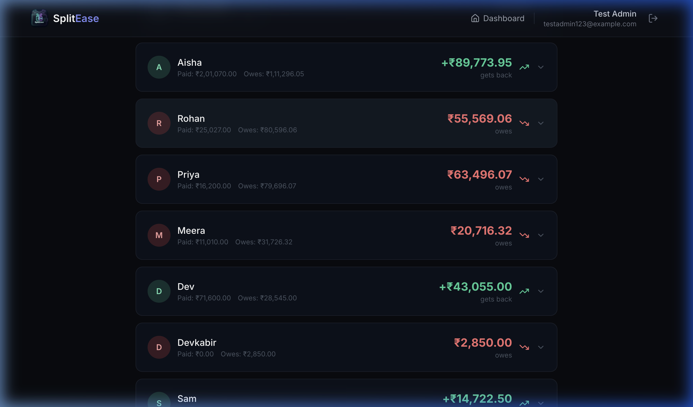
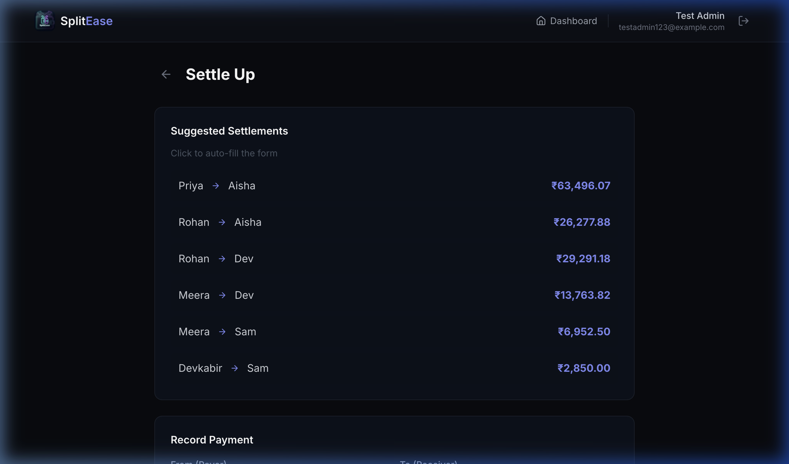

# SplitEase — Shared Expenses Tracker

A full-stack web application for tracking shared expenses among flatmates, built for the Spreetail Software Developer assignment.

## Features

- **User Authentication** — Register/login with JWT-based sessions
- **Group Management** — Create expense groups with time-bounded membership (members can join and leave)
- **Expense Tracking** — Create expenses with 4 split types: equal, unequal, percentage, and share (ratio-based)
- **Multi-Currency** — Supports INR and USD with exchange rate conversion
- **CSV Import** — Upload `expenses_export.csv` with automatic anomaly detection (19 anomalies detected and handled)
- **Import Report** — Visual report showing every anomaly found and action taken
- **Balance Calculation** — Net balances with expense-level breakdown (shows exactly which expenses contribute)
- **Debt Simplification** — Minimized settlement plan (fewest transactions to settle all debts)
- **Settlement Recording** — Record payments between members

## Screenshots

### Group Balances View
Displays the calculated net balances for all flatmates, including detailed expandability to see exactly which expenses a member paid or owes.



### Settle Up & Settlement Plan
Suggests the simplified, greedy settlement transactions (who pays whom how much) and enables recording payments.



## Tech Stack

| Layer | Technology |
|-------|-----------|
| Frontend | React 18 + Vite + Tailwind CSS |
| Backend | Node.js + Express.js |
| Database | PostgreSQL (Supabase) |
| Auth | JWT (jsonwebtoken + bcryptjs) |
| CSV Parsing | csv-parse |

## Project Structure

```
spreetail/
├── frontend/          # React + Vite + Tailwind
│   ├── src/
│   │   ├── components/    # Navbar
│   │   ├── context/       # AuthContext
│   │   ├── pages/         # LoginPage, Dashboard, GroupDetail, AddExpense, ImportCSV, Balances, SettlePage
│   │   └── services/      # API service (Axios)
│   └── .env.example
├── backend/           # Node.js + Express
│   ├── src/
│   │   ├── routes/        # auth, groups, expenses, balances, settlements, import
│   │   ├── middleware/    # JWT authentication
│   │   ├── utils/         # csvParser, splitCalculator, balanceCalculator
│   │   ├── db.js          # PostgreSQL connection
│   │   └── server.js      # Express entry point
│   └── .env.example
├── README.md
├── SCOPE.md
├── DECISIONS.md
└── AI_USAGE.md
```

## Setup Instructions

### Prerequisites
- Node.js 18+ 
- A Supabase account (free tier: https://supabase.com)

### 1. Database Setup
1. Create a new project on Supabase
2. Go to **SQL Editor** in your Supabase dashboard
3. Copy the contents of `backend/src/setup.sql` and run it
4. Go to **Settings → Database** and copy your connection string

### 2. Backend Setup
```bash
cd backend
cp .env.example .env
# Edit .env with your Supabase connection string and a JWT secret
npm install
npm run dev
```

### 3. Frontend Setup
```bash
cd frontend
cp .env.example .env
# Edit .env if your backend runs on a different port
npm install
npm run dev
```

### 4. Open the App
Visit `http://localhost:5173` in your browser.

### 5. Import the CSV
1. Register/login
2. Create a group (e.g., "Flat 4B")
3. Go to **Import CSV** and upload `Expenses Export.csv`
4. Review the anomalies detected
5. Confirm the import

## AI Tools Used

- **Antigravity IDE (Claude)** — Used as primary development collaborator for architecture planning, code scaffolding, and debugging
- See `AI_USAGE.md` for detailed usage log including cases where AI output was incorrect

## Deployed URLs

- **Frontend Application (Static Site)**: [https://spreetail-za8l.onrender.com/](https://spreetail-za8l.onrender.com/)
- **Backend API (Web Service)**: [https://spreetail-backend-hjek.onrender.com/](https://spreetail-backend-hjek.onrender.com/)
